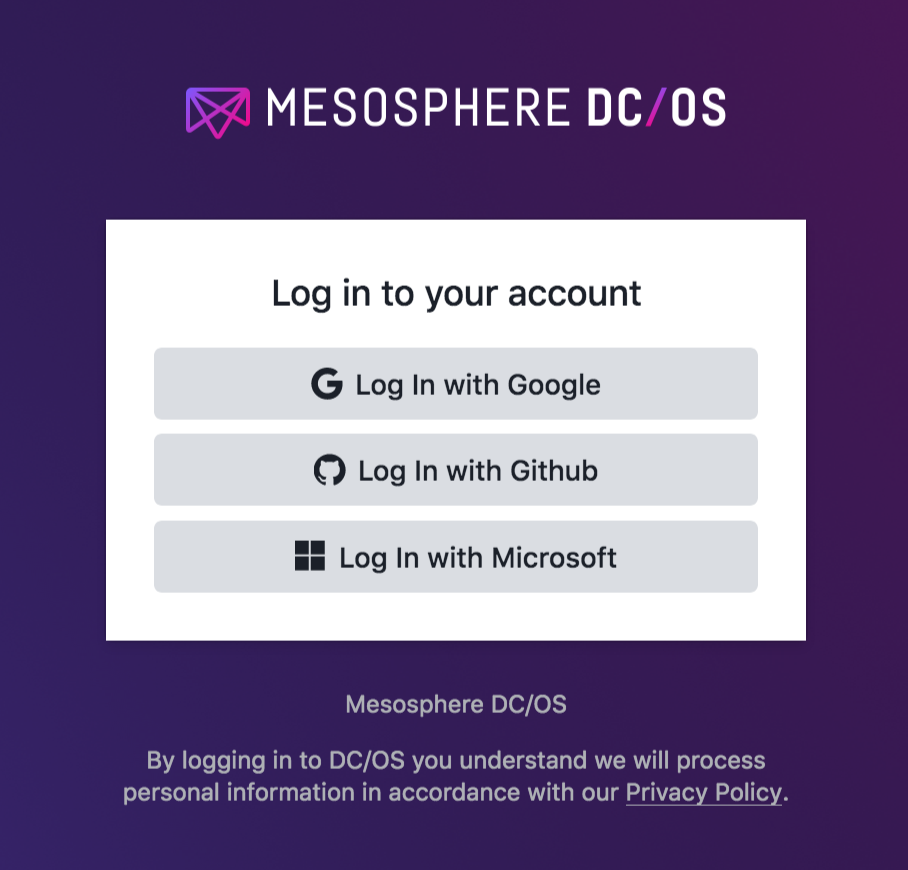
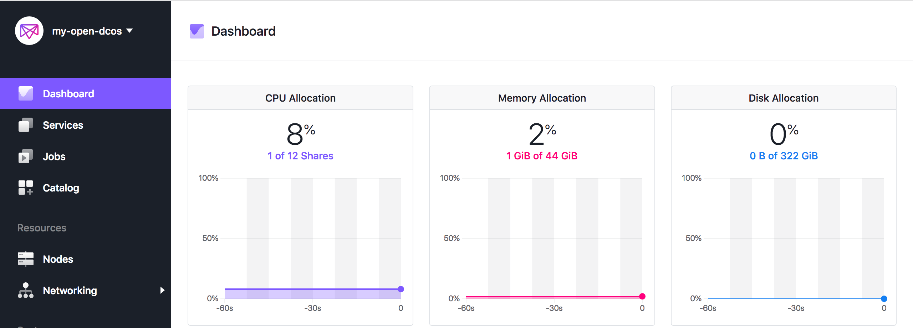
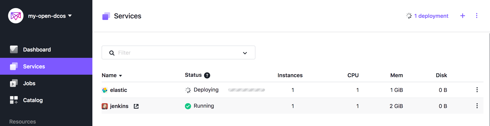

# Install the Mesosphere DC/OS on AWS China Region
In this guide will walk you through step-by-step on how to:
- Create an Open Source DC/OS Cluster on AWS in China Region, here I use the NingXia Region cn-northwest-1 as example
- Destroy the cluster and all AWS resources associated with it

## Hightlight
- Follow the [official guide](https://docs.mesosphere.com/1.12/installing/evaluation/mesosphere-supported-methods/aws/) 
- Update the IAM policy as China region format, such as `"Service": "ec2.amazonaws.com.cn"` 
- Update the IBM policy ARN as China region format, such as `"Resource": "arn:aws-cn:s3" `
- By default instance type is `m4` serial

## Prerequisites
Terraform, AWS cloud credentials, SSH keys

### Installing Terraform
- If you using MacOS as machine running deployment commands:
```
workspace ray$ brew install terraform
workspace ray$ terraform -v
Terraform v0.11.10
```

- If you using Linux as machine running deployment commands:
```
[ec2-user@ip-10-0-0-16 ~]$ curl -O https://releases.hashicorp.com/terraform/0.11.10/terraform_0.11.10_linux_amd64.zip
[ec2-user@ip-10-0-0-16 ~]$ sudo unzip terraform_0.11.10_linux_amd64.zip -d /usr/bin/
Archive:  terraform_0.11.10_linux_amd64.zip
  inflating: /usr/bin/terraform      
[ec2-user@ip-10-0-0-16 ~]$ terraform -v
Terraform v0.11.10
```

### Set the AWS Cloud Credentials and Default AWS Region

```
[ec2-user@ip-10-0-0-16 ~]$ export AWS_DEFAULT_REGION="cn-northwest-1"
[ec2-user@ip-10-0-0-16 ~]$ aws configure
AWS Access Key ID [None]: xxx
AWS Secret Access Key [None]: xxxx
Default region name [None]: cn-northwest-1
Default output format [None]: json
```

### Add your SSH keys to your ssh agent

Add your ssh private key to ssh agent and record the public key location which will used in Terraform template.
- You can using the existed key-pair in AWS cloud
```
[ec2-user@ip-10-0-0-16 ~]# eval `ssh-agent -s`
[ec2-user@ip-10-0-0-16 ~]# ssh-add ~/.ssh/my-key-pair-cn-northwest-1.pem
```
- You can also generate a new ssh key-pair, remember AWS cloud only accept the private key as `pem` file
```
[ec2-user@ip-10-0-0-16 ~]# ssh-keygen
[ec2-user@ip-10-0-0-16 .ssh]$ openssl rsa -in ~/.ssh/id_rsa -outform pem > id_rsa.pem
writing RSA key
[ec2-user@ip-10-0-0-16 .ssh]$ chmod 600 id_rsa.pem
[ec2-user@ip-10-0-0-16 ~]# eval `ssh-agent -s`
[ec2-user@ip-10-0-0-16 ~]# ssh-add ~/.ssh/id_rsa.pem
```

### Enterprise Edition

DC/OS Enterprise Edition also requires a valid license key provided by Mesosphere that we will pass into our `main.tf` as `dcos_license_key_contents`

## Creating a Cluster
### Prepare the template

- Make a folder
```
[ec2-user@ip-10-0-0-16 ~]$ mkdir mesoswphere
[ec2-user@ip-10-0-0-16 ~]$ cd mesoswphere/
```
- Copy and paste the sample template below into a `main.tf` file
You can modify the parameter based on your environment requirement. The parameter guide can be found in [Advanced DC/OS on AWS](https://docs.mesosphere.com/1.12/installing/evaluation/mesosphere-supported-methods/aws-advanced)
The sample in here create DC/OS cluster with
 - 1 Master
 - 2 Private Agents
 - 1 Public Agent

The output should be printed once cluster creation is complete:
 - master-ips - A list of Your DC/OS Master Nodes.
 - cluster-address - The URL you use to access DC/OS UI after the cluster is setup.
 - public-agent-loadbalancer - The URL of your Public routable services.

The sample [main.tf](https://github.com/liangruibupt/mesosphere/blob/master/main.tf) 

```
variable "dcos_install_mode" {
  description = "specifies which type of command to execute. Options: install or upgrade"
  default     = "install"
}

# Used to determine your public IP for forwarding rules
data "http" "whatismyip" {
  url = "http://whatismyip.akamai.com/"
}

module "dcos" {
  source  = "dcos-terraform/dcos/aws"
  version = "~> 0.1"

  dcos_instance_os    = "coreos_1855.5.0"
  cluster_name        = "my-open-dcos"
  ssh_public_key_file = "~/.ssh/id_rsa.pub"
  admin_ips           = ["${data.http.whatismyip.body}/32"]

  num_masters        = "1"
  num_private_agents = "2"
  num_public_agents  = "1"

  dcos_version = "1.11.4"

  # dcos_variant              = "ee"
  # dcos_license_key_contents = "${file("./license.txt")}"
  dcos_variant = "open"

  dcos_install_mode = "${var.dcos_install_mode}"
}

output "masters-ips" {
  value = "${module.dcos.masters-ips}"
}

output "cluster-address" {
  value = "${module.dcos.masters-loadbalancer}"
}

output "public-agents-loadbalancer" {
  value = "${module.dcos.public-agents-loadbalancer}"
}
```

- Initialize the DC/OS modules
```
[ec2-user@ip-10-0-0-16 ~]$ terraform init
```

### Update module template for China Region
In this document using `cn-northwest-1` and `dcos_instance_os    = "coreos_1855.5.0"` as example

- Make sure you have add the coreos_1855.5.0_cn-northwest-1 = "THE-CHINA-REGION-AMI-ID" to variables.tf under dcos-terraform-terraform-aws-tested-oses module
 You can locate the coreos_1855.5.0 AMI from `EC2 console`, in this document, the `CoreOS-stable-1855.5.0-hvm - ami-0deaa8ada18aec612` will be used

```
[ec2-user@ip-10-0-0-16 mesoswphere]$ cd /home/ec2-user/mesoswphere/.terraform/modules/
[ec2-user@ip-10-0-0-16 modules]$ find . -name "variables.tf" | xargs grep coreos_1855.5.0_us-east-1
./d99c56292580257ac8db5932b7260aaf/dcos-terraform-terraform-aws-tested-oses-9d12bad/variables.tf:    coreos_1855.5.0_us-east-1      = "ami-0bb5afc82c391abb7"
[ec2-user@ip-10-0-0-16 modules]$ vi ./d99c56292580257ac8db5932b7260aaf/dcos-terraform-terraform-aws-tested-oses-9d12bad/variables.tf

Append the coreos_1855.5.0_cn-northwest-1 = "ami-0deaa8ada18aec612" under coreos_1855.5.0 section
```

- Update the IAM policy as China region format `amazonaws.com.cn`, such as `"Service": "ec2.amazonaws.com.cn"`
```
[ec2-user@ip-10-0-0-16 modules]$ find . -name "*.tf" | xargs grep ec2.amazonaws.com
./4a68d476add99f51b98409007be95061/dcos-terraform-terraform-aws-iam-732ca6f/main.tf:        "Service": "ec2.amazonaws.com"
./4a68d476add99f51b98409007be95061/dcos-terraform-terraform-aws-iam-732ca6f/main.tf:        "Service": "ec2.amazonaws.com"
```

- Update the IAM policy ARN as China region format `arn:aws-cn`, such as `"Resource": "arn:aws-cn:s3"`

```
[ec2-user@ip-10-0-0-16 modules]$ find . -name "*.tf" | xargs grep arn:aws
From the result, You only need take care the generic ones as below
./4a68d476add99f51b98409007be95061/dcos-terraform-terraform-aws-iam-732ca6f/main.tf:            "Resource": "arn:aws:s3:::soak-cluster-logs"
./4a68d476add99f51b98409007be95061/dcos-terraform-terraform-aws-iam-732ca6f/main.tf:            "Resource": "arn:aws:s3:::soak-cluster-logs/*"
./4a68d476add99f51b98409007be95061/dcos-terraform-terraform-aws-iam-732ca6f/main.tf:            "arn:aws:s3:::soak-cluster-elk-snapshots"
./4a68d476add99f51b98409007be95061/dcos-terraform-terraform-aws-iam-732ca6f/main.tf:          "Resource": "arn:aws:s3:::soak-cluster-logs"
./4a68d476add99f51b98409007be95061/dcos-terraform-terraform-aws-iam-732ca6f/main.tf:          "Resource": "arn:aws:s3:::soak-cluster-logs/*"

You can ignore the region specific ones as below
./4a68d476add99f51b98409007be95061/dcos-terraform-terraform-aws-iam-732ca6f/main.tf:          "Resource": "arn:aws:es:us-east-1:159577368695:domain/scaletestlogsinkpublic/*"
./2ecdde255497635b26a84c7b5338c609/dcos-terraform-terraform-aws-elb-dcos-2d7af12/main.tf: *   masters_acm_cert_arn = "arn:aws:acm:us-east-1:123456789123:certificate/ooc4NeiF-1234-5678-9abc-vei5Eeniipo4"
./106d3b437ebfb290731d195ab84a133e/dcos-terraform-terraform-aws-elb-masters-dac18f6/main.tf: *   https_acm_cert_arn = "arn:aws:acm:us-east-1:123456789123:certificate/ooc4NeiF-1234-5678-9abc-vei5Eeniipo4"
./17bc9f957dca1163b437d35f1403173d/dcos-terraform-terraform-aws-elb-masters-internal-100d26a/main.tf: *   https_acm_cert_arn = "arn:aws:acm:us-east-1:123456789123:certificate/ooc4NeiF-1234-5678-9abc-vei5Eeniipo4"
./9420f912eb883ccbdd0d561090abba84/dcos-terraform-terraform-aws-elb-public-agents-1226e52/main.tf: *   https_acm_cert_arn = "arn:aws:acm:us-east-1:123456789123:certificate/ooc4NeiF-1234-5678-9abc-vei5Eeniipo4"
./05e95323a497107fa47ecd7198629b00/dcos-terraform-terraform-aws-elb-fb17756/main.tf: *   aws_external_masters_acm_cert_arn = "arn:aws:acm:us-east-1:123456789123:certificate/ooc4NeiF-1234-5678-9abc-vei5Eeniipo4"

```

### Run the execution plan
Execute `terraform plan` and save it to a static file - in this case, `plan.out`

```
terraform plan -out=plan.out

```
You will receive message as below to indicate the `plan.out` has been successfully generated.

```
Plan: 38 to add, 0 to change, 0 to destroy.

------------------------------------------------------------------------

This plan was saved to: plan.out

To perform exactly these actions, run the following command to apply:
    terraform apply "plan.out"

```

### Let Terraform to build/deploy the plan
```
terraform apply plan.out
```
If you have any problem, fix it and then generate the `updated plan` based on the `terraform.tfstate` to apply it again.
```
#terraform plan -out=plan_update.out -state=terraform.tfstate
#terraform apply "plan_update.out"
```

Once Terraform has completed applying our plan, you should see output similar to the following:

```
Apply complete! Resources: 3 added, 0 changed, 0 destroyed.

Outputs:

cluster-address = my-open-dcos-1551385834.cn-northwest-1.elb.amazonaws.com.cn
masters-ips = [
    52.82.30.84
]
public-agents-loadbalancer = ext-my-open-dcos-1935366512.cn-northwest-1.elb.amazonaws.com.cn
```

Congratulations - you’ve successfully installed a DC/OS cluster on AWS!

### Using your cluster

- Access the cluster from browser by using `masters-ips` or `cluster-address`
If you can not access above DNS and IP. You should edit your security group, for example
```
Change 
dcos-my-open-dcos-master-lb-firewall port 80/443 source to your_desktop_ip or 0.0.0.0/0
dcos-my-open-dcos-admin-firewall. port 80/443/22 source to your_desktop_ip or 0.0.0.0/0
```
> Login



- Check the DC/OS cluster from Dashboard and deploy a service for testing
In the service panel, click `Run a Service` or you can launch service from `Catalog` with certified packages.

> Dashboard



> Services



## Next step
You can follow up the guide to [Scaling Your Cluster](https://docs.mesosphere.com/1.12/installing/evaluation/mesosphere-supported-methods/aws/#scaling-your-cluster) or [Upgrading Your Cluster](https://docs.mesosphere.com/1.12/installing/evaluation/mesosphere-supported-methods/aws/#upgrading-your-cluster)


## Deleting Your Cluster
```
#terraform destroy
```
Or you can run

```
[ec2-user@ip-10-0-0-33 mesoswphere]$ terraform plan -destroy -out=plan_destory.out
...
Plan: 0 to add, 0 to change, 38 to destroy.

------------------------------------------------------------------------

This plan was saved to: plan_destory.out

To perform exactly these actions, run the following command to apply:
    terraform apply "plan_destory.out"

[ec2-user@ip-10-0-0-33 mesoswphere]$ terraform apply "plan_destory.out"
...
Apply complete! Resources: 0 added, 0 changed, 38 destroyed.
```

## Trouble Shooting
- Key pair related
```
module.dcos.module.dcos-infrastructure.module.dcos-master-instances.module.dcos-master-instances.null_resource.instance-prereq: timeout - last error: ssh: handshake failed: ssh: unable to authenticate, attempted methods [none publickey], no supported methods remain
```
Make sure your private key as `pem` file and add it to your ssh agent by `ssh-add`
```
openssl rsa -in ~/.ssh/id_rsa -outform pem > id_rsa.pem
writing RSA key
chmod 600 id_rsa.pem
ssh-add ~/.ssh/id_rsa.pem
```

- Lookup the aws_ami failed, this is caused by China Region identifies has not included in Terraform default module

```
module.dcos.module.dcos-infrastructure.module.dcos-publicagent-instances.module.dcos-public-agent-instances.module.dcos-tested-oses.data.template_file.aws_ami: 1 error(s) occurred:

module.dcos.module.dcos-infrastructure.module.dcos-publicagent-instances.module.dcos-public-agent-instances.module.dcos-tested-oses.data.template_file.aws_ami: lookup: lookup failed to find 'coreos_1855.5.0_cn-northwest-1' in:
```
Make sure you have add the coreos_1855.5.0_cn-northwest-1 = "THE-CHINA-REGION-AMI-ID" to variables.tf under dcos-terraform-terraform-aws-tested-oses module 

```
cd /home/ec2-user/mesoswphere/.terraform/modules/
find . -name "variables.tf" | xargs grep coreos_1855.5.0_us-east-1
/home/ec2-user/mesoswphere/.terraform/modules/d99c56292580257ac8db5932b7260aaf/dcos-terraform-terraform-aws-tested-oses-9d12bad/variables.tf
Append coreos_1855.5.0_cn-northwest-1 = "THE-CHINA-REGION-AMI-ID" under coreos_1855.5.0 section
```


